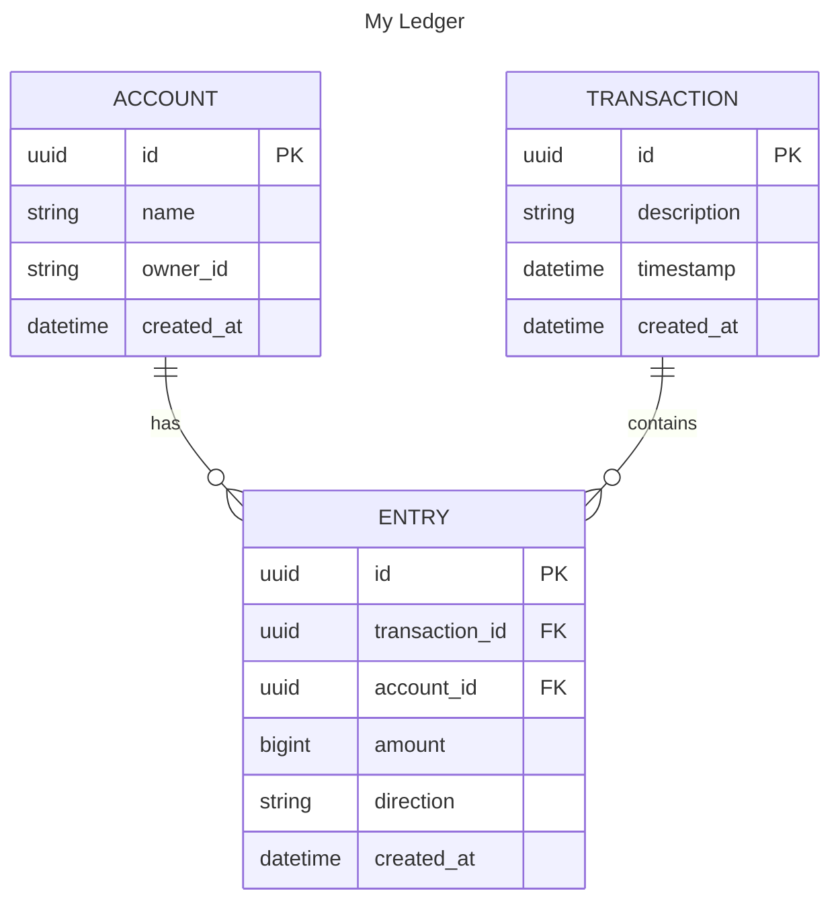

# My Ledger

A simple ledger application.

## Functional Requirements

1. Record transaction: log each money movement.
2. Calculate current balance: compute the current state of accounts.
3. Transactions history: provide access to historical transaction records.

## Non-functional Requirements

1. Use in-memory data store.
2. Do not use external software.

## Assumptions

1. The service should track all transactions individually per accounts
2. Only money movements (debit or credit) are tracked; no complex financial calculations are performed.
3. All movements are timestamped and immutable once recorded.
4. Balance is computed based on the sum of historical transactions.
5. All transactions follow the double-entry bookkeeping model to ensure accuracy and traceability. You can read more here: [Books, an immutable double-entry accounting database service](https://developer.squareup.com/blog/books-an-immutable-double-entry-accounting-database-service/)
6. Since the is no authentication, the service does not track which user initiated a transaction.
7. Amounts stored as cents

## Entities



## RESTful API

### Account
This section describes the Account API.

| Method | Path                  | Description                               |
|--------|-----------------------|-------------------------------------------|
| POST   | /account              | Creates a new account                     | 
| GET    | /account              | List all accounts                         |
| GET    | /account/{id}         | Get account by ID                         | 
| GET    | /account/{id}/balance | Calculates and return the current balance |

### Transaction
This section describes the Transaction API

| Method | Path              | Description             |
|--------|-------------------|-------------------------|
| POST   | /transaction      | Record a transaction    | 
| GET    | /transaction      | List all transactions   | 
| GET    | /transaction/{id} | Get a transaction by ID | 


## Building & Running

To build or run the project, use one of the following tasks:

| Task              | Description             |
|-------------------|-------------------------|
| `./gradlew check` | Build and run all tests |
| `./gradlew run`   | Run the server          |

If the server starts successfully, you'll see the following output:

```
2024-12-04 14:32:45.584 [main] INFO  Application - Application started in 0.303 seconds.
2024-12-04 14:32:45.682 [main] INFO  Application - Responding at http://0.0.0.0:8080
```

## Testing the Service via make

This project includes a [Makefile](src/main/bash/Makefile) that simplifies testing the API endpoints using curl.

### Available Commands

| Command                                                    | Description                                   |
|------------------------------------------------------------|-----------------------------------------------|
| `make create-account`                                      | Create a new account with random UUID         |
| `make get-accounts`                                        | List all accounts                             |
| `make get-account id=<UUID>`                               | Fetch account by ID                           |
| `make get-account-balance id=<UUID>`                       | Get account balance                           |
| `make create-transaction acc1=<DEBIT_ID> acc2=<CREDIT_ID>` | Create a new transaction between two accounts |
| `make get-transactions`                                    | List all transactions                         |
| `make get-transaction id=<UUID>`                           | Fetch transaction by ID                       |


